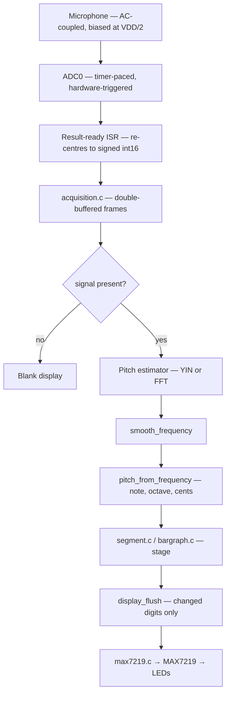

# Tuna — Chromatic Instrument Tuner

**Tuna** is embedded C firmware for a chromatic instrument tuner built around the
Microchip **AVR64DD14** microcontroller. It continuously samples audio from an
on-chip ADC, estimates the fundamental frequency of the incoming note, maps that
frequency to the nearest equal-tempered musical note, and shows the result on a
two-digit 7-segment display together with a 20-element LED bar graph that acts as
a centred "tuning needle". The whole signal chain — sampling, pitch estimation
and rendering — runs on a single 8-bit MCU with no operating system, using a
cooperative state machine and a double-buffered acquisition pipeline.

This documentation is the complete technical reference for the project.

## Contents

| Chapter | Covers |
|---|---|
| [Overview](overview.md) | What Tuna is, design goals, end-to-end data flow |
| [Hardware](hardware.md) | Target MCU, the acquisition path, display wiring and register map |
| [Building, flashing and CI](building.md) | Toolchain, CMake build, flashing, the CI pipeline |
| [Architecture](architecture.md) | State machine, acquisition pipeline, module layering |
| [Signal processing](signal-processing.md) | Silence gating, YIN, FFT, windows, note mapping, smoothing |
| [Display subsystem](display.md) | Framebuffer, 7-segment/bar-graph renderers, MAX7219 driver |
| [Configuration](configuration.md) | Every `config.h` macro and build-time override |
| [Module reference](module-reference.md) | Per-module quick reference and dependency map |
| [Testing](testing.md) | Host regression-test suite and how CI uses it |
| [Glossary](glossary.md) | Terms and abbreviations |

## At a glance



## Licensing

Tuna is released into the **public domain** under the
[Unlicense](https://unlicense.org/). Every source file carries the Unlicense
header.

> [!NOTE]
> The diagrams in this documentation use [Mermaid](https://mermaid.js.org/),
> which GitHub renders natively. If you read these files in an editor without
> Mermaid support, the diagram source is still plain text inside the fenced
> ```` ```mermaid ```` blocks.
