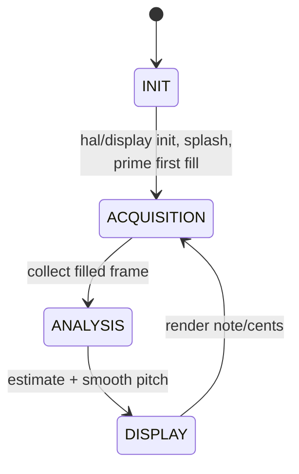
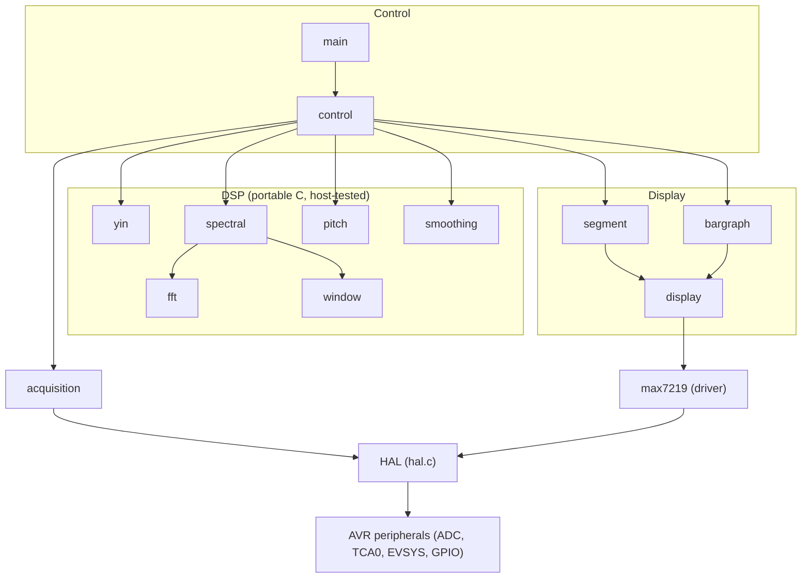

# Architecture

[← Back to index](README.md)

## Source layout

| Path | Contents |
|---|---|
| `src/` | All firmware sources; each module is a `.c` with its `.h` alongside. |
| `cmake/avr-toolchain.cmake` | The AVR cross-compile toolchain file. |
| `CMakeLists.txt` | Top-level firmware build. |
| `test/` | Standalone host (native) regression-test project. |
| `.github/workflows/ci.yml` | Continuous-integration pipeline. |

## The cooperative state machine

Tuna is **not** an RTOS. `main()` (`src/main.c`) is simply:

```c
int main(void)
{
    for (;;) {
        control();
    }
}
```

All behaviour lives in `control()` (`src/control.c`), which advances a single
static state variable:



| State | Responsibility |
|---|---|
| `INIT` | `hal_init()`, `max7219_init()`, the `greet_message()` splash, then `acquisition_prime()` to launch the first background fill. Transitions to `ACQUISITION`. |
| `ACQUISITION` | `acquisition_collect()` blocks (CPU asleep) until the in-flight fill finishes, returns the just-filled frame, and immediately relaunches the next fill into the other buffer. Transitions to `ANALYSIS`. |
| `ANALYSIS` | Gate on `signal_is_present()`; if silent, force frequency to 0. Otherwise run the configured pitch estimator (`yin_frequency()` or `spectral_frequency()`). Then `smooth_frequency()`. Transitions to `DISPLAY`. |
| `DISPLAY` | `display_note()` renders note/octave/cents and flushes the framebuffer. Transitions back to `ACQUISITION`. |

After `INIT` the machine cycles `ACQUISITION → ANALYSIS → DISPLAY` indefinitely.

## The double-buffered acquisition pipeline

Acquisition and analysis are **pipelined**. `acquisition.c` owns two
`int16_t[FRAME_SIZE]` buffers and ping-pongs between them: while one buffer is
being analysed (and overwritten in place — see below), the ADC fills the other in
the background. Sampling therefore **overlaps** analysis and display instead of
stalling them.

The table shows how the two buffers stay busy. Each column is one pipeline slot;
read down a column to see what happens to each buffer at the same time:

| | slot 1 | slot 2 | slot 3 | slot 4 |
|---|---|---|---|---|
| **Buffer A** | fill | analyse + display | fill | analyse + display |
| **Buffer B** | — | fill | analyse + display | fill |

While buffer A is being analysed and displayed, buffer B is being filled by the
ADC, and vice versa. `acquisition_prime()` kicks off slot 1 (the first fill of
A); from then on every `acquisition_collect()` hands back the freshly-filled
buffer and immediately starts the next fill into the other one.

How a fill works:

1. `acquisition_prime()` points `filling_buffer` at buffer A and calls
   `acquisition_start()`, which arms the result-ready interrupt and enables TCA0.
2. Each timer overflow triggers a conversion in hardware; the `ADC0_RESRDY` ISR
   calls `acquisition_callback()`, which stores the (re-centred) sample into
   `fill_buffer[fill_index]` and increments the index, setting `fill_complete`
   when `FRAME_SIZE` samples have arrived.
3. `acquisition_collect()` calls `acquisition_wait()`, which sleeps the CPU in
   idle (`hal_sleep_idle()`) until `fill_complete`, then stops the timer. It
   returns the filled buffer and swaps `filling_buffer` to the other buffer,
   relaunching the next fill.

> [!NOTE]
> The timer keeps pacing conversions until it is stopped, so a wake is always
> pending while the buffer fills: the wait loop cannot miss completion and
> deadlock. It can only ever oversleep by at most one sample period. The CPU is
> asleep the rest of the acquisition window (~250 ms at the default settings),
> which is the firmware's main power saving.

### In-place processing within a frame

Within a single frame the signal-processing stages operate **in place on the one
buffer** — both pitch estimators overwrite the analysis buffer as they work (the
FFT path packs, transforms and writes magnitudes back over it; silence detection
runs first precisely because of this). The second acquisition buffer is the
SRAM cost of pipelining; do not add further intermediate copies casually.

The buffer handed back by `acquisition_collect()` is owned by the caller **only
until the next call**, and may be clobbered during analysis.

## Layered structure

The firmware is organised into clear layers, hardware at the bottom:



| Layer | Modules and role |
|---|---|
| **HAL** (hardware abstraction) | `hal.c` / `hal.h` — the **only** hardware-touching module. Wraps ADC sampling, the timer-driven sample counter with a callback, the bit-banged MAX7219 pins, an idle-sleep primitive, and busy-wait delays. Retargeting goes through here. |
| **Driver** | `max7219.c` / `max7219.h` — register-level MAX7219 driver. Register addresses are `#define`s; each 16-bit frame is clocked out via the HAL pin setters. |
| **Display** | `display.c` (shadow framebuffer + diff-and-flush), `segment.c` (digits/letters), `bargraph.c` (level/needle). Renderers **stage** into the framebuffer; one `display_flush()` transmits only changed digits. |
| **DSP** | `fft.c` (fixed-point in-place complex FFT + shared `fix_mpy`/`SINEWAVE`), `window.c` (window coefficient tables + application), `spectral.c` (real-input FFT pitch path), `yin.c` (time-domain YIN pitch path), `pitch.c` (frequency → note), `smoothing.c` (per-frame stabiliser). |
| **Control** | `control.c`, `main.c` — the cooperative state machine and startup splash. |

The HAL is the seam for porting. Everything above it is, in principle,
hardware-independent; indeed the DSP layer is exercised on the host as plain C.

## Why these design choices

- **State machine over RTOS** — there is exactly one logical task (sample →
  analyse → show), so a single-threaded cooperative loop is simpler, smaller, and
  has no scheduler overhead or stack-per-task cost.
- **Hardware-triggered conversions** — routing the timer overflow straight to the
  ADC start via the event system removes ISR-latency jitter from the sample
  clock, which matters because every reported frequency is `SAMPLE_FREQ`-derived.
- **Sleep while sampling** — idle sleep keeps peripherals (TCA0, ADC) running
  while stopping the CPU clock, so the long acquisition window costs almost no CPU
  activity.
- **Diff-and-flush display** — coalescing each frame's updates into one burst of
  **only the changed** digit registers minimises bit-banged bus traffic.
