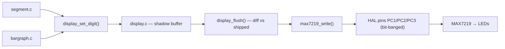

# Display subsystem

[← Back to index](README.md)

The display stack turns a detected note into LEDs. It is layered: renderers
(`segment`, `bargraph`) stage digit bytes into a shadow framebuffer (`display`);
one flush diffs that against what the chip last received and pushes only the
changes through the driver (`max7219`) over the bit-banged HAL pins.



## Shadow framebuffer (display.c)

`display.c` keeps two 5-byte arrays (`DISPLAY_DIGITS = 5`):

- `shadow[]` — the digit values staged by the renderers since the last flush.
- `shipped[]` — the values the MAX7219 was last actually given.

`shipped[]` is zero-initialised to match the digit registers right after
`max7219_reset()` / `max7219_init()`, so the very first flush correctly sends only
non-zero digits.

| Function | Behaviour |
|---|---|
| `display_set_digit(digit, value)` | Stage a raw segment byte into `shadow[digit]`. Out-of-range indices are ignored. Nothing is transmitted yet. |
| `display_flush()` | For each digit where `shadow[digit] != shipped[digit]`, write it to the matching `MAX7219_DIGIT_n` register and update `shipped[digit]`. Unchanged digits cost no bus traffic. |

The payoff: a frame's worth of `segment_*` and `bargraph_*` calls coalesce into a
single flush that emits **only the digits that actually changed**, minimising
bit-banged transfers to the display.

## 7-segment renderer (segment.c)

`segment.c` drives digits 0 and 1 (the two 7-segment characters). It owns three
font tables of raw segment bytes:

| Table | Contents |
|---|---|
| `FONT_ALPHA[26]` | Glyphs for `A`..`Z` (those that are legible on 7 segments). |
| `FONT_NUM[10]` | Glyphs for digits `0`..`9`. |
| `SMILE[2]` | The two-digit `:)` smiley used in the splash. |

| Function | Behaviour |
|---|---|
| `segment_display_char(digit, alpha, dotpoint)` | Render uppercase letter `alpha` on `digit` (0 or 1). If `dotpoint` is set, OR in the decimal-point segment (`0x80`). Used for note letters, with the dot marking accidentals. |
| `segment_display_alpha(digit, alpha)` | Convenience wrapper: a letter with no decimal point. |
| `segment_display_num_digit(digit, value, dotpoint)` | Render decimal digit `value` (0–9) on `digit`, optional decimal point. Used for the octave number. |
| `segment_smile()` | Stage the two-digit smiley (splash only). |

All four **stage** into the framebuffer; a `display_flush()` is needed to show
them.

## Bar graph renderer (bargraph.c)

`bargraph.c` drives the 20-element (`BARGRAPH_SIZE = 20`) LED bar across digits 2,
3 and 4. The logical state is a `uint32_t` bitmask (one bit per LED). A private
`bargraph_stage()` packs that mask into the three MAX7219 digit bytes (digits
2/3/4) using a fixed bit-shuffle and stages them via `display_set_digit()`.

| Function | Behaviour |
|---|---|
| `bargraph_set_level(level, origin)` | Light a contiguous run of `level` LEDs from either end. `origin` is `BARGRAPH_LEFT` (run grows from the left) or `BARGRAPH_RIGHT` (run sits against the right). Used by the splash's growing bar. |
| `bargraph_set_binary(value)` | Set the LED pattern directly from a raw bitmask. Used for the tuning needle, where a single bit is lit at the cents position. |

Both stage into the framebuffer; a flush makes them visible.

## Putting a note on screen (display_note)

`display_note()` in `control.c` ties the renderers together. Given the
stabilised frequency it calls `pitch_from_frequency()`, then:

- **Invalid / silent** (`note.valid == 0`): blank both 7-segment digits and clear
  the bar, flush, and return.
- **Valid note:**
  - **Digit 0** — the note letter via `segment_display_char()`. The accidental
    flag (`NOTE_ACCIDENTAL[]`) lights the decimal point for sharps/flats. The
    letter tables match the chosen accidental convention (German `H` for B).
  - **Digit 1** — the octave number via `segment_display_num_digit()`.
  - **Bar graph** — the cents deviation as a centred needle. The ±50 cents range
    is mapped onto LED positions `0..BARGRAPH_SIZE-1`:

    ```c
    position = (cents + 50) * (BARGRAPH_SIZE - 1) / 100 + 0.5;  // clamped to range
    bargraph_set_binary(1UL << position);                       // single lit LED
    ```

    Left of centre = flat, right = sharp, centre = in tune.

A single `display_flush()` then pushes the whole frame, sending only the digit
registers that changed since the previous frame.

## Startup splash (greet_message)

On `INIT`, `greet_message()` plays a short animation, each step a render + flush +
`hal_delay_ms()`:

1. `HI` with a small left-origin bar (level 6), 1 s.
2. The `:)` smiley with a longer bar (level 13), 1 s.
3. `TU` (level 16), 0.5 s.
4. `NA` (level 20, full bar), 0.5 s.
5. Clear digits and bar, ready for tuning.

## MAX7219 driver (max7219.c)

The driver is register-level and protocol-only; it touches the chip exclusively
through the HAL pin setters.

| Function | Behaviour |
|---|---|
| `max7219_init()` | Idle the pins (`DIN` low, `CLK` low, `LOAD` high), `max7219_reset()`, then set scan limit to 4 (digits 0–4), intensity to max (`0x07`), and leave shutdown (normal operation). |
| `max7219_write(address, data)` | Clock a 16-bit frame (address in the high byte, data in the low byte) out MSB-first: `LOAD` low, then for each bit set `DIN` and pulse `CLK` high/low, then `LOAD` high to latch. |
| `max7219_reset()` | Write `0x00` to every register `0x00..0x0F`, defining the known-zero state the shadow framebuffer's `shipped[]` assumes. |

Register addresses (no-op, the eight digit registers, decode mode, intensity,
scan limit, shutdown, display test) are `#define`s in `max7219.h`.
