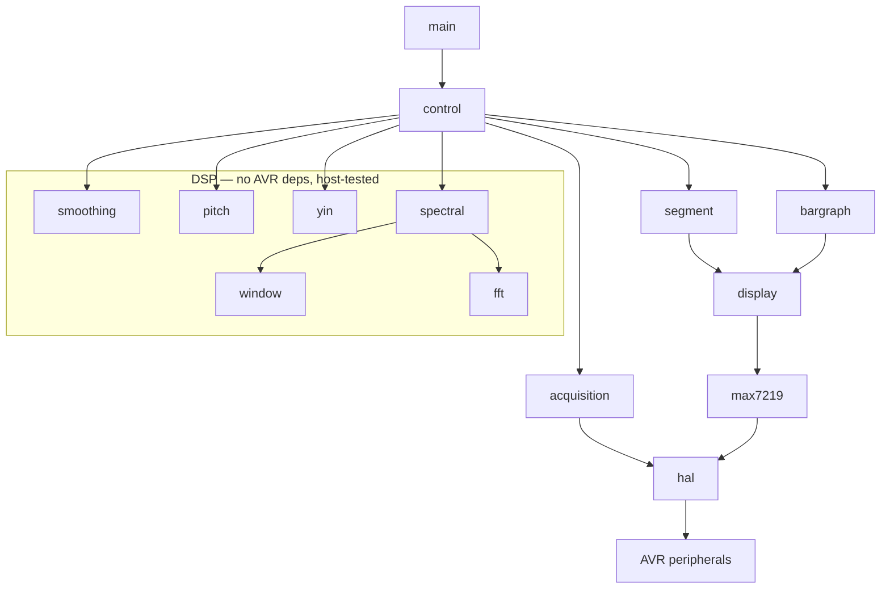

# Module reference

[← Back to index](README.md)

Every module is a `.c`/`.h` pair sharing the same banner-comment section layout
(INCLUDES / DEFINITIONS AND MACROS / TYPEDEFS / PROTOTYPES / …) and beginning with
the Unlicense header and a Doxygen `@file`/`@brief` block. New files should follow
suit. This chapter is a per-module quick reference; the algorithms behind the DSP
modules are detailed in [Signal processing](signal-processing.md).

## Control layer

### main.c

The entry point. `main()` is an infinite loop calling `control()`. No other logic.

### control.c / control.h

The cooperative state machine (`INIT → ACQUISITION → ANALYSIS → DISPLAY → …`) plus
the startup splash and the note-rendering glue.

| Symbol | Role |
|---|---|
| `control(void)` (public) | Advance the state machine one step. Called repeatedly by `main()`. |
| `greet_message()` (static) | Power-up `HI`/`:)`/`TU`/`NA` splash animation. |
| `display_note(frequency)` (static) | Map frequency → note and render letter/octave/cents needle (or blank if invalid). |
| `signal_is_present(buffer)` (static) | Silence gate: true if at least `SIGNAL_MIN_SAMPLES` samples deviate from the frame mean by ≥ `SILENCE_THRESHOLD`. |

## Acquisition

### acquisition.c / acquisition.h

Double-buffered ADC acquisition pipeline.

| Symbol | Role |
|---|---|
| `acquisition_prime(void)` (public) | Launch the first background fill. Call once before the first collect. |
| `acquisition_collect(void)` (public) | Block (CPU asleep) until the in-flight fill completes, relaunch the next fill into the other buffer, and return the just-filled `FRAME_SIZE` frame. The returned buffer is valid only until the next call and may be overwritten in place during analysis. |
| `acquisition_start` / `acquisition_wait` / `acquisition_callback` (static) | Arm/await the fill and store each ISR-delivered sample; set `fill_complete` at `FRAME_SIZE`. |

Owns `acquisition_buffer_a` / `acquisition_buffer_b` and the `volatile` fill
state shared with the ISR.

## HAL and driver

### hal.c / hal.h

The only hardware-touching module — the porting seam.

| Function | Role |
|---|---|
| `hal_init()` | Configure clock (24 MHz), ADC0, TCA0, the event-system trigger, and the display GPIOs. |
| `hal_start_sample_counter(cb)` | Arm the ADC result-ready ISR and enable the sample-rate timer; `cb` receives each sample. |
| `hal_stop_sample_counter()` | Disable the timer and ISR; reset the counter. |
| `hal_set_din/clk/load(value)` | Set the three bit-banged MAX7219 pins (PC1/PC2/PC3). |
| `hal_sleep_idle()` | Enter idle sleep (CPU stopped, peripherals running) until an interrupt. |
| `hal_delay_ms/us(n)` | Busy-wait delays (splash timing) via `<util/delay.h>`. |
| `ISR(ADC0_RESRDY_vect)` | Read `ADC0.RES`, re-centre by `ADC_ZERO_OFFSET`, hand the sample to the callback. |

`HAL_SAMPLE_COUNTER_CALLBACK` is the `void(int16_t)` callback type.

### max7219.c / max7219.h

Register-level MAX7219 driver: `max7219_init()`, `max7219_write(address, data)`
(MSB-first bit-bang of a 16-bit frame), `max7219_reset()`. Register addresses are
`#define`s.

## Display

### display.c / display.h

Shadow framebuffer over the five MAX7219 digit registers.
`display_set_digit(digit, value)` stages; `display_flush()` transmits only changed
digits. `DISPLAY_DIGITS = 5`.

### segment.c / segment.h

7-segment rendering for digits 0/1: `segment_display_char`,
`segment_display_alpha`, `segment_display_num_digit`, `segment_smile`. Owns the
`FONT_ALPHA`/`FONT_NUM`/`SMILE` glyph tables. Stages into the framebuffer.

### bargraph.c / bargraph.h

20-LED bar graph across digits 2/3/4. `bargraph_set_level(level, origin)` lights a
run from one end; `bargraph_set_binary(value)` sets a raw bitmask (used for the
needle). `BARGRAPH_SIZE = 20`, origins `BARGRAPH_LEFT`/`BARGRAPH_RIGHT`. Stages
into the framebuffer.

## DSP

### fft.c / fft.h

Fixed-point (Q15) in-place radix-2 complex FFT. `fft(fr, fi, m, inverse)` returns
the inverse-scaling factor (0 for forward). `fix_mpy(a, b)` is the rounded Q15
multiply; `SINEWAVE[]` is the shared 3/4-period sine table. Original authors:
Tom Roberts, Malcolm Slaney, Dimitrios P. Bouras, Pepijn de Vos; adapted by
Dennis Witzig.

### window.c / window.h

Pre-FFT window taper. `window_apply_window(time_data)` scales the frame by the
selected Q15 coefficient table (`WINDOW[FRAME_SIZE/2]`, symmetric) using
`>> 15`. The table is chosen at compile time from `WINDOW_FUNCTION`.

### spectral.c / spectral.h

FFT pitch path (compiled when `PITCH_METHOD_FFT`). `spectral_frequency(samples)`
removes DC, windows, runs the real-input FFT (pack/transform/split via
`real_bin_mag`, `real_dc_nyquist_mag`, `isqrt_rounded`), picks the peak, applies
HPS-style octave correction (`fundamental_divisor`), and returns the
log-parabolically-interpolated frequency. Owns `fft_scratch[FRAME_SIZE/2]`.

### yin.c / yin.h

YIN pitch path (compiled when `PITCH_METHOD_YIN`). `yin_frequency(samples)`
computes the cumulative-mean-normalised difference function, applies the absolute
threshold (with a global-minimum fallback), parabolically interpolates the lag,
and returns `SAMPLE_FREQ / lag`. Owns `cmnd[YIN_TAU_MAX]`.

### pitch.c / pitch.h

Note mapping. `pitch_from_frequency(frequency)` returns a `NOTE` {pitch_class,
octave, cents, valid} using equal temperament (A4 = 440). `PITCH_CLASS` enum and
`NOTE` struct live in the header; accidental naming follows `ACCIDENTAL_SHARP`.

### smoothing.c / smoothing.h

Per-frame stabiliser. `smooth_frequency(raw)` applies EMA smoothing within a held
note, snaps on real note changes, and rejects transient octave jumps until they
persist for `OCTAVE_JUMP_FRAMES`. Holds its own static state; pure floating-point
C (host-testable).

## Module dependency overview

`config.h` is included nearly everywhere as the single source of tunables. Only
the HAL, the MAX7219 driver, and the acquisition/control glue touch hardware; the
DSP subtree is portable C.
