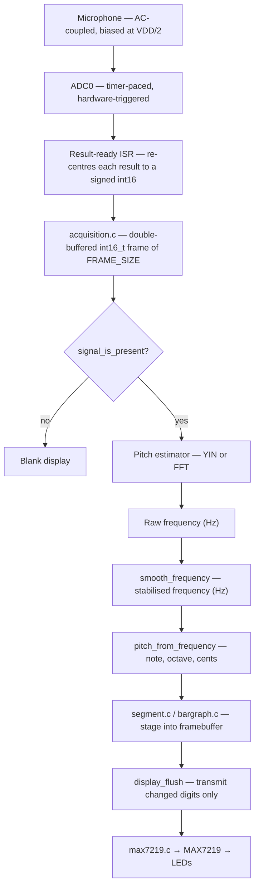

# Overview

[← Back to index](README.md)

## What Tuna does

Tuna turns a bare AVR microcontroller into a standalone chromatic tuner. Point an
instrument at the microphone, play a note, and Tuna tells you:

- **which note** it is (note letter on the first 7-segment digit, with a decimal
  point marking accidentals),
- **which octave** it is in (digit two), and
- **how far off pitch** you are, as a needle on the LED bar graph — left of centre
  means flat, right of centre means sharp, dead centre means in tune.

When the room is quiet the display blanks itself instead of chasing noise, and on
power-up it plays a short `HI` → `:)` → `TU` → `NA` greeting animation.

## Design goals

| Goal | How it is met |
|---|---|
| Run on a small 8-bit MCU | All processing fits on an AVR64DD14 (64 KB flash, limited SRAM). Pitch detection is fixed-point/integer where it matters; the FFT is an in-place real-input transform that needs only a half-size scratch buffer. |
| Never stall the signal chain | Acquisition and analysis are double-buffered and pipelined: the ADC fills one buffer in the background (CPU asleep) while the previous frame is analysed and displayed. |
| Stable, readable output | A per-frame smoother (EMA + octave-jump rejection) steadies the cents needle and rejects transient half/double-pitch errors from the estimator. |
| Be portable and buildable from source | The build is plain CMake + the open AVR GNU toolchain (avr-gcc, avr-libc, binutils, avrdude). No proprietary IDE or compiler licence is required. |
| Two interchangeable pitch engines | The pitch estimator is a compile-time choice between a time-domain **YIN** autocorrelation method (default) and a frequency-domain **FFT** peak picker, so the two can be benchmarked head-to-head. |

## End-to-end data flow

One frame of audio travels through the firmware like this:

Each stage is described in detail in the chapters that follow.

## Licensing

Tuna is released into the **public domain** under the
[Unlicense](https://unlicense.org/). Every source file carries the Unlicense
header. You are free to copy, modify, build, sell or redistribute it for any
purpose without restriction.
