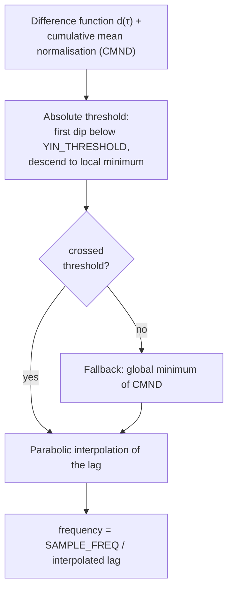
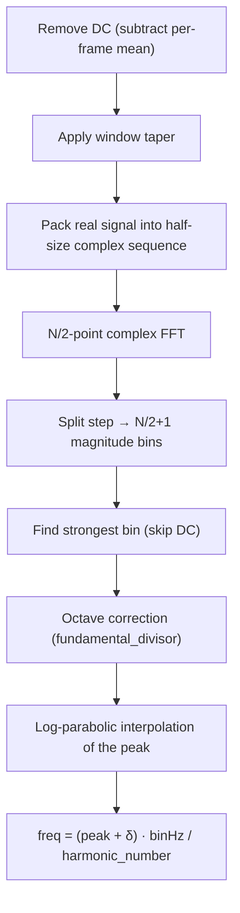
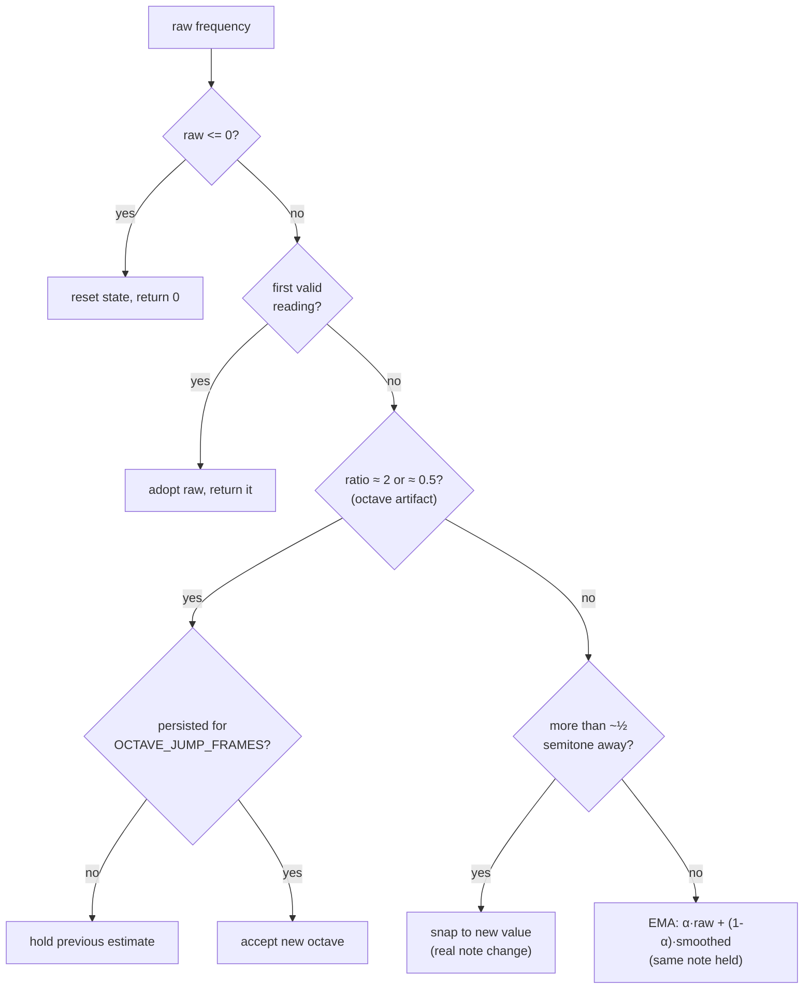

# Signal processing and pitch detection

[← Back to index](README.md)

This chapter covers the DSP heart of Tuna: how a frame of raw ADC samples becomes
a frequency in Hz, how that frequency becomes a musical note, and how the reading
is stabilised. The DSP modules are plain integer/fixed-point/floating C with **no
AVR dependencies**, which is why they are also exercised by the host test suite.

## Silence gating

Before any pitch estimation, `signal_is_present()` (`control.c`) decides whether
the frame carries a usable signal. A quiet room otherwise drives the estimator
from noise and flickers random notes.

It computes the frame's **DC level** (mean) and then checks whether any sample
deviates from that mean by at least `SILENCE_THRESHOLD` (in ADC counts):

```text
mean = (Σ buffer[k]) / FRAME_SIZE
for each sample: if |buffer[k] - mean| >= SILENCE_THRESHOLD → signal present
```

Gating on the **AC excursion** (distance from the mean) rather than raw sample
magnitude means a residual DC bias on the AC-coupled input can neither mask a
quiet signal nor be mistaken for one. When the frame is silent, `control()` sets
the frequency to 0, which blanks the display.

## Pitch method selection

Exactly one pitch engine is compiled in, chosen at build time:

```c
#if defined(PITCH_METHOD_YIN)
    peak_freq = yin_frequency(analysis_buffer);
#elif defined(PITCH_METHOD_FFT)
    peak_freq = spectral_frequency(analysis_buffer);
#endif
```

`config.h` defaults to `PITCH_METHOD_YIN` and enforces that **exactly one** method
is defined (a `#error` fires otherwise). Both functions have the same contract:
take the acquisition buffer, return a frequency in Hz (0 meaning "no pitch"), so
they are drop-in interchangeable and can be benchmarked against each other.

| | YIN (default) | FFT |
|---|---|---|
| Domain | Time (autocorrelation) | Frequency (spectral peak) |
| Windowing | None | DC removal + window taper |
| Core cost | `O(YIN_W · YIN_TAU_MAX)` | `O(FRAME_SIZE · log FRAME_SIZE)` |
| Octave handling | Inherent (period detection) | Explicit HPS-style correction |
| Extra RAM | `cmnd[YIN_TAU_MAX]` floats | `fft_scratch[FRAME_SIZE/2]` int16 |
| Arithmetic | Mostly integer, some float | Fixed-point FFT + float interp |

## The YIN method (time domain)

`yin_frequency()` (`src/yin.c`) implements steps 1–5 of the YIN algorithm
(de Cheveigné & Kawahara, 2002): difference function, cumulative mean
normalisation, absolute threshold, and parabolic interpolation.



### Lag range

| Constant | Value | Meaning |
|---|---|---|
| `YIN_W` | `FRAME_SIZE / 2` | Integration window: sample pairs summed per lag. |
| `YIN_TAU_MIN` | 2 | Smallest lag → highest detectable frequency (`SAMPLE_FREQ/2`), skips trivial lags 0/1. |
| `YIN_TAU_MAX` | 256 | Largest lag → lowest detectable frequency = `SAMPLE_FREQ/YIN_TAU_MAX` (≈16 Hz at 4096 Hz). |

16 Hz is well below the lowest bass string (a 5-string low B is ≈31 Hz), so a
larger lag would only buy unused range. Since the difference-function cost is
`O(YIN_W · YIN_TAU_MAX)`, halving the lag halves the dominant loop. The window
only needs `YIN_W + YIN_TAU_MAX ≤ FRAME_SIZE` samples.

### Difference function + normalisation

The squared-difference function `d(τ)` and its cumulative-mean normalisation are
computed in one pass. The key performance trick is the **fixed-point
accumulator**:

```c
for (tau = 1; tau < YIN_TAU_MAX; ++tau) {
    uint32_t acc = 0;
    for (j = 0; j < YIN_W; ++j) {
        int16_t d = (int16_t)((samples[j] - samples[j + tau]) >> 1);
        acc += (uint32_t)((int32_t)d * d);
    }
    running_sum += acc;
    cmnd[tau] = (running_sum > 0)
              ? (float)((double)acc * (double)tau / (double)running_sum)
              : 1.0f;
}
```

Each per-sample difference is pre-scaled by one bit (`>> 1`) so that `YIN_W`
terms — each at most `(4095/2)²` — cannot overflow a `uint32`. That lets the inner
loop use an inline 16×16→32 widening multiply and a 32-bit add, instead of the
`__mulsi3` (32-bit multiply) and `__adddi3` (64-bit add) libgcc helper calls that
would otherwise run on **every one** of the `YIN_W · YIN_TAU_MAX` iterations and
dominate cost on an 8-bit AVR. The 1-bit scale cancels in the cumulative-mean
ratio, so it does not affect the result. `running_sum` stays a 64-bit accumulator
(its total reaches ≈10¹¹) but is updated only once per lag, and the single
floating-point divide is deferred to the normalisation step.

### Threshold and interpolation

1. **Absolute threshold:** scan from `YIN_TAU_MIN` for the first lag whose CMND
   value dips below `YIN_THRESHOLD` (default 0.15; lower is stricter), then descend
   to that dip's local minimum. That lag is the period estimate.
2. **Fallback:** if nothing crosses the threshold, use the global minimum of the
   CMND over the lag range.
3. **Parabolic interpolation:** fit a parabola to the CMND around the chosen lag
   for sub-sample period accuracy.

The frequency is `SAMPLE_FREQ / interpolated_lag` (0 if the lag is non-positive).

## The FFT method (frequency domain)

`spectral_frequency()` (`src/spectral.c`) estimates pitch from the magnitude
spectrum. It is only compiled when `PITCH_METHOD_FFT` is selected.



### Pre-processing

1. **DC removal:** the per-frame mean is subtracted from every sample. The
   AC-coupled input is biased at VDD/2 and re-centred by a fixed offset, so a
   small residual bias can remain and would otherwise leak through the window into
   the low bins.
2. **Windowing:** `window_apply_window()` tapers the frame to reduce spectral
   leakage (see [Window functions](#window-functions)).

### Real-input FFT via a half-size complex FFT

A real signal of length `N` is transformed using an `N/2`-point **complex** FFT,
halving both the work and the RAM versus running a full complex FFT on a zeroed
imaginary part.

1. **Pack:** form `z[n] = x[2n] + j·x[2n+1]`. The odd samples go into the
   `fft_scratch[]` (imaginary) array; the even samples are compacted into the low
   half of the caller's buffer (the compaction reads ahead of where it writes, so
   it is safe in place).
2. **Transform:** `fft(samples, fft_scratch, LOG2_FRAME_SIZE - 1, 0)` runs the
   `N/2`-point complex FFT.
3. **Split:** recover the `N/2 + 1` magnitude bins of the true `N`-point spectrum.
   Each bin `k` combines `Z[k]` with its mirror `Z[N/2−k]`, so the pair
   `{k, N/2−k}` is computed and written together to avoid clobbering a value the
   mirror still needs. The purely-real DC and Nyquist bins are handled specially
   (`real_dc_nyquist_mag`), the general bins by `real_bin_mag()` which applies the
   bin's twiddle factor `W = exp(−j·2πk/N)` read from the shared `SINEWAVE` table.
   Magnitudes are written back in place over `samples[]`. They are consistently
   scaled — only **relative** bin heights matter for peak picking.

`fft_scratch[]` holds only `FRAME_SIZE/2` `int16_t` entries — half the storage of
a full imaginary buffer.

### Peak picking, octave correction and interpolation

1. **Find the strongest bin** (skipping DC bin 0). This bin is also the
   best-frequency-resolved candidate.
2. **Octave correction** (`fundamental_divisor()`): the strongest bin is
   frequently a **harmonic**, not the fundamental. This HPS-style step decides
   which sub-multiple of the peak is the true fundamental — see below.
3. **Parabolic interpolation** of the peak in bin space for sub-bin resolution.
   The parabola is fitted to the **log** magnitudes (the more accurate estimator
   for the near-Gaussian main lobe of a window; the `+1` keeps `log()` finite for
   an empty bin). The **peak** is interpolated — not the possibly-weak fundamental
   bin — and then divided down, so the fundamental is resolved at
   `harmonic_number` times finer absolute resolution.

The returned frequency is:

```text
freq = (peak_index + delta) · (SAMPLE_FREQ / FRAME_SIZE) / harmonic_number
```

### Octave correction in detail

`fundamental_divisor()` steps down from the peak bin to the **lowest** divisor `m`
(up to `FFT_MAX_SUBHARMONIC`) for which every harmonic of `peak/m` up to the peak
is actually present in the spectrum — i.e. each supporting bin reaches
`peak >> FFT_HARMONIC_THRESHOLD_SHIFT` in magnitude. Each harmonic is checked over
a ±1-bin neighbourhood so an off-grid fundamental still registers. A pure tone has
no supporting sub-harmonics and stays at `m = 1`.

| Constant | Default | Effect |
|---|---|---|
| `FFT_MAX_SUBHARMONIC` | 4 | Largest sub-multiple considered (how far down to search for the fundamental). |
| `FFT_HARMONIC_THRESHOLD_SHIFT` | 4 | Supporting-harmonic magnitude threshold is `peak >> shift`. A **larger** shift is a **lower** threshold: it recovers weaker/missing fundamentals but is more permissive under noise. |

## The fixed-point FFT core

`fft()` (`src/fft.c`) is a classic radix-2 decimation-in-time, in-place complex
FFT working in **Q15 fixed point**: the range −32768..+32767 represents
−1.0..+1.0. Integer arithmetic is used for speed instead of floating point.

- For the **forward** transform, **fixed scaling** (one right-shift per pass) is
  applied for proper normalisation — over `log2(n)` passes this is an overall
  `1/n`, distributed to maximise arithmetic accuracy, and it maps a 0 dB
  sine/cosine to two −6 dB frequency coefficients. The return value is always 0.
- For the **inverse** transform, fixed scaling cannot be used (two 0 dB
  coefficients would sum to a peak of 64 K, overflowing Q15), so it does
  **variable scaling** and returns the number of bits by which the output must be
  shifted left to recover the true amplitude. (Tuna only uses the forward
  direction.)

Supporting pieces shared via `fft.h`:

| Symbol | Role |
|---|---|
| `fix_mpy(a, b)` | Q15 multiply with rounding: `((a·b) >> 14)` then a rounding shift. Exposed for the real-FFT split step in `spectral.c`. |
| `SINEWAVE[]` | Quarter-wave-plus sine table, `SINEWAVE[i] = sin(2πi/FRAME_SIZE)` in Q15. To conserve flash it stores only 3/4 of a period (indices `0 .. 3·FRAME_SIZE/4 − 1`); cosine is read as `SINEWAVE[i + FRAME_SIZE/4]`. Shared by `fft()` and the real-FFT twiddle factors. |

<a id="window-functions"></a>

## Window functions

`window.c` provides the taper applied before the FFT (the YIN path does **not**
window its input). `WINDOW_FUNCTION` in `config.h` selects one coefficient table
at compile time via `#if/#elif`; an unset/unknown value triggers a `#error`.

| `WINDOW_*` value | Window |
|---|---|
| `WINDOW_DIRICHLET` | Rectangular — no taper. |
| `WINDOW_HANNING` | Hann window (the shipped default). |
| `WINDOW_HAMMING` | Hamming window. |
| `WINDOW_BLACKMAN` | Blackman window. |

Each table holds `FRAME_SIZE/2` Q15 coefficients for the first half; the window
is symmetric, so `window_apply_window()` applies coefficient `i` to both
`time_data[i]` and `time_data[FRAME_SIZE-1-i]`. Scaling is done by
`(sample · WINDOW[i]) >> 15` rather than a divide by `INT16_MAX` — the AVR has no
hardware divide, and the `1/32768` vs `1/32767` difference is a 0.003 % amplitude
scale, irrelevant to peak picking. The `bench_window` host benchmark compares
pitch accuracy across all four windows and guards that the default stays accurate.

## Mapping frequency to a note

`pitch_from_frequency()` (`src/pitch.c`) converts a frequency in Hz to the
nearest equal-tempered note, returning a `NOTE`:

```c
typedef struct {
    PITCH_CLASS pitch_class; /* nearest pitch class (C .. H)             */
    int8_t      octave;      /* octave index (octave 1 starts at C1)     */
    double      cents;       /* deviation from the note, -50 .. +50 cents */
    uint8_t     valid;       /* non-zero if the frequency mapped to a note */
} NOTE;
```

The math (A4 = 440 Hz, MIDI note 69, 12 semitones/octave):

```text
midi    = 69 + 12 · log2(frequency / 440)
nearest = round(midi)                       // nearest integer semitone
octave  = nearest / 12 - 1                   // scientific pitch notation
cents   = (midi - nearest) · 100             // tuning deviation, ±50
```

Octave numbering follows scientific pitch notation (octave 1 starts at C1). The
table spans octaves 0..8, but the estimators can only resolve up to the Nyquist
frequency (`SAMPLE_FREQ/2`), so the top of the range is unreachable at the
configured sample rate (with `SAMPLE_FREQ = 4096`, nothing above ≈C7 is
detectable). The bound is kept for defensiveness. A non-positive or out-of-range
frequency returns `.valid = 0`, which blanks the display.

`PITCH_CLASS` is an enum whose members switch on the accidental convention:

- `ACCIDENTAL_SHARP` → `C, C_SHARP, D, D_SHARP, E, F, F_SHARP, G, G_SHARP, A, A_SHARP, H`
- otherwise (flats) → `C, D_FLAT, D, E_FLAT, E, F, G_FLAT, G, A_FLAT, A, H_FLAT, H`

Note the German naming convention: **H** is used for what English-speakers call B.

## Frequency smoothing

`smooth_frequency()` (`src/smoothing.c`) stabilises the per-frame estimate before
display, combining an exponential moving average with octave-jump rejection. It
holds three pieces of static state: the smoothed value, a "have a value yet" flag,
and an octave-jump vote counter.



The logic, per frame:

1. **Silence** (`raw <= 0`): reset all state and return 0.
2. **First valid reading:** adopt it directly, return it.
3. **Octave-artifact check:** compute `ratio = raw / smoothed`.
   - `ratio ≈ 2` (1.8–2.2) or `ratio ≈ 0.5` (0.45–0.55) → treat as a possible
     half/double-pitch error. **Hold** the previous estimate unless this octave
     jump persists for `OCTAVE_JUMP_FRAMES` consecutive frames; only then accept
     it.
   - Otherwise reset the vote counter and continue.
4. **Note-change vs hold:** recompute `ratio`.
   - `ratio < 0.97` or `ratio > 1.03` (more than ≈½ semitone away) → a **real note
     change**: snap straight to the new value.
   - Otherwise **the same note is held**: apply the EMA
     `smoothed = α·raw + (1−α)·smoothed` to steady the cents readout.

| Constant | Default | Effect |
|---|---|---|
| `SMOOTHING_ALPHA` | 0.5 | EMA weight on the newest estimate while refining a held note (0..1). Lower steadies the cents needle at the cost of a slower response. |
| `OCTAVE_JUMP_FRAMES` | 3 | Consecutive frames an octave jump must persist before it is accepted as real rather than a transient half/double-pitch error. |

This separation — snap on genuine note changes, smooth within a held note, and
veto fleeting octave errors — is what makes the cents needle steady without
feeling sluggish when you change notes.
